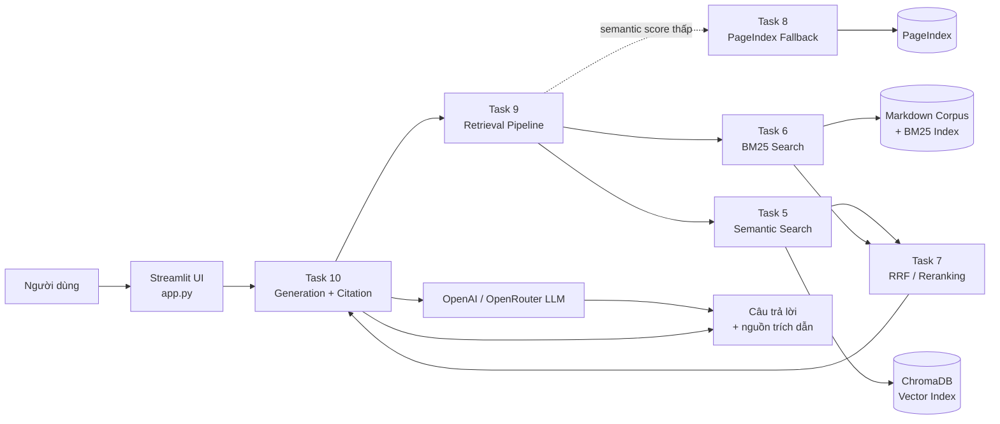

# Bài Tập Nhóm — University Services RAG Chatbot

## Mục Tiêu

Sau khi hoàn thành bài cá nhân, nhóm ngồi lại để xây dựng **1 trong 2 sản phẩm**:

---

## Yêu cầu 1: Sản phẩm nhóm RAG Chatbot

Xây dựng chatbot trả lời câu hỏi về dịch vụ và chính sách đại học liên quan.

**Yêu cầu:**
- Giao diện chat (Streamlit / Gradio / Chainlit)
- Trả lời có citation (dựa trên Task 10)
- Hỗ trợ follow-up questions (conversation memory)
- Hiển thị source documents đã dùng

**Stack gợi ý:**
```
Chainlit/Streamlit → Retrieval (Task 9) → Generation (Task 10) → Display
```

---

## Yêu cầu 2: RAG Evaluation Pipeline

Sử dụng **1 trong 3 framework** sau để evaluate pipeline RAG của nhóm:

### Framework lựa chọn

| Framework | Cài đặt | Đặc điểm |
|-----------|---------|-----------|
| [DeepEval](https://github.com/confident-ai/deepeval) | `pip install deepeval` | Nhiều metric built-in, dễ integrate với pytest |
| [RAGAS](https://github.com/explodinggradients/ragas) | `pip install ragas` | Chuẩn industry cho RAG eval, 3 trục chính |
| [TruLens](https://github.com/truera/trulens) | `pip install trulens` | Dashboard UI, feedback functions mạnh |

### Yêu cầu Evaluation

1. **Tạo Golden Dataset** — tối thiểu 15 cặp Q&A (question, expected_answer, expected_context)
2. **Chạy evaluation** trên toàn bộ golden dataset với các metrics sau:
   - **Faithfulness** — câu trả lời có bám đúng context không?
   - **Answer Relevance** — câu trả lời có đúng câu hỏi không?
   - **Context Recall** — retriever có lấy đủ evidence không?
   - **Context Precision** — trong context lấy về, bao nhiêu % thực sự hữu ích?
3. **So sánh A/B** — chạy eval trên ít nhất 2 config khác nhau (ví dụ: có reranking vs không reranking, hoặc hybrid vs dense-only)
4. **Báo cáo** — bảng điểm + phân tích worst performers + đề xuất cải tiến

Xem code mẫu (DeepEval/RAGAS/TruLens) chi tiết trong `README.md` gốc mục "Yêu cầu 2".

### Deliverable Evaluation

- [ ] File `group_project/evaluation/golden_dataset.json` — 15+ cặp Q&A
- [ ] File `group_project/evaluation/eval_pipeline.py` — script chạy evaluation
- [ ] File `group_project/evaluation/results.md` — bảng điểm + phân tích
- [ ] So sánh A/B ít nhất 2 configs

---

## Yêu Cầu Chung

1. **Tích hợp pipeline** từ bài cá nhân của các thành viên
2. **Demo hoạt động được** trong buổi trình bày (chạy local hoặc deploy)
3. **Evaluation pipeline** chạy được và có báo cáo kết quả
4. **Code push lên repository** chung của nhóm
5. **README** mô tả kiến trúc và phân công (điền bên dưới)

---

## Kiến Trúc Hệ Thống



### Mô tả luồng

1. Task 4 đọc dữ liệu Markdown, chunk tài liệu, tạo embedding và lưu vào ChromaDB.
2. Task 5 thực hiện semantic search trên vector index của Task 4.
3. Task 6 xây dựng BM25 index từ cùng collection/corpus với Task 4.
4. Task 7 kết hợp các danh sách kết quả bằng RRF/reranking.
5. Task 9 điều phối hybrid retrieval và gọi Task 8 làm fallback khi semantic score thấp.
6. Task 10 sắp xếp context, gọi LLM, tạo câu trả lời tiếng Việt và kiểm tra citation.
7. Streamlit hiển thị câu trả lời, nguồn tài liệu, lịch sử hội thoại và hỗ trợ follow-up.

---

## Phân Công Công Việc

| Thành viên | MSSV | Nhiệm vụ | Trạng thái |
|-----------|------|----------|------------|
| Nhữ Trọng Thành | 2A202601977 | Task 9, 10 | Hoàn thành |
| Mai Hồng Sơn | 2A202601921 | Task 5, 6 | Hoàn thành |
| Lê Thị Linh | 2A202601441 | Task 3, 4 | Hoàn thành |
| Vũ Thu Huyền | 2A202601583 | Task 1, 2 | Hoàn thành |
| Lường Thị Hảo | 2A202601637 | Task 7, 8 | Hoàn thành |

---

## Hướng Dẫn Chạy

```bash
# Cài đặt dependencies
pip install -r requirements.txt

# Chạy app
streamlit run app.py
# hoặc
chainlit run app.py
```

---

## Lưu ý

Hãy giữ lại repo này nếu như bạn học track 3 giai đoạn 2, chúng ta sẽ phát triển tiếp dự án lên knowledge graph để khắc phục các câu hỏi hóc búa khi có các câu hỏi khó.
