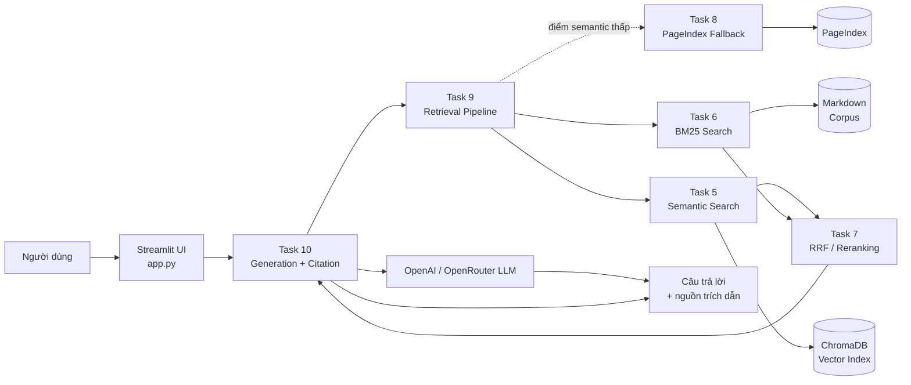

# Thành viên nhóm

## Kiến trúc hệ thống

## Phân công thành viên

| Thành viên | Mã học viên | Nhiệm vụ |
|---|---|---|
| Nhữ Trọng Thành | 2A202601977 | Task 9, 10 |
| Mai Hồng Sơn | 2A202601921 | Task 5, 6 |
| Lê Thị Linh | 2A202601441 | Task 3, 4 |
| Vũ Thu Huyền | 2A202601583 | Task 1, 2 |
| Lường Thị Hảo | 2A202601637 | Task 7, 8 |
